# Military Symbology & CoT Types — A Primer for ATAK Newcomers

If you're new to ATAK/WinTAK, the first confusing thing you'll hit is that
every icon on the map — the blue rectangles, red diamonds, yellow diamonds,
green squares — is driven by a short machine-readable code, not a picture.
That code is the **Cursor-on-Target (CoT) `type` attribute**, and its shape
comes from **military symbology standards**: NATO **APP-6** and its US
equivalent **MIL-STD-2525**. This doc explains the concepts and then gives a
reference table for every symbol produced by the examples in this repo.

## 1. The big picture

- **MIL-STD-2525 / APP-6** define how to draw a military symbol: a frame
  shape + colour (who is it?), an icon inside the frame (what is it?), and
  optional modifiers around it (echelon, status, unique designation, ...).
- **CoT (Cursor-on-Target)** is the XML message format ATAK/WinTAK/TAK Server
  use to move positions and events around a network. Every `<event>` has a
  `type="..."` attribute — a compact, hyphen-separated string that ATAK maps
  to a symbol, a colour, and a behaviour (does it show on the map? does it
  raise an alert? is it a chat message?).
- The CoT type scheme is **inspired by** MIL-STD-2525/APP-6 affiliation and
  battle-dimension codes, but it is **not** a literal Symbol ID Code (SIDC).
  It's a shorter, ATAK-specific vocabulary layered on top of the same ideas.

## 2. Anatomy of a CoT type string

Most types you'll see look like `a-f-G-U-C` or `b-m-p-w`. Read them
left-to-right, most-general to most-specific:

```
a   -   f   -   G   -   U   -   C
│       │       │       └───┴── function id (hierarchical, optional, gets
│       │       │                more specific left→right)
│       │       └── battle dimension (Ground)
│       └── affiliation (Friend)
└── root/category (Atom — a real-world military track or position)
```

| Root | Category | Meaning | Rendered by ATAK as |
|---|---|---|---|
| `a` | **Atom** | A tracked military entity (unit, equipment, person) with an affiliation + dimension | A MIL-STD-2525/APP-6-style symbol (frame + icon), coloured by affiliation |
| `b` | **Bits** | A non-military "report" — marker, alert, chat, sensor point, etc. | Custom ATAK icon/behaviour (not a 2525 symbol) |
| `u` | **User** | A user-drawn shape (circle, polygon, route, geofence) | Drawing/overlay object, not a point icon |
| `t` / `r` | Tasking / Reply | Machine-to-machine requests (e.g. "send position") | Not usually visible on the map |

The examples in this repo only use `a`, `b`, and `u` roots — that covers the
vast majority of what you'll see moving across an ATAK mesh network.

## 3. Affiliation — "whose side is it on?" (2nd token of `a-*` types)

Affiliation is the single biggest driver of colour on the ATAK map:

| Code | Affiliation | ATAK colour |
|---|---|---|
| `f` | Friend | **Cyan / blue** |
| `h` | Hostile | **Red** |
| `n` | Neutral | **Green** |
| `u` | Unknown | **Yellow** |
| `a` | Assumed Friend | Blue (hollow/dashed variants in full 2525) |
| `s` | Suspect | Red (hollow/dashed variants in full 2525) |
| `p` | Pending | Yellow (not yet evaluated) |
| `j` / `k` | Joker / Faker | Exercise-only friend/hostile simulants |
| `o` | None specified | Grey/white |

This is exactly the same affiliation concept as MIL-STD-2525/APP-6 "Standard
Identity" — ATAK just spells it with a single lowercase letter instead of the
2-digit SIDC field.

## 4. Battle dimension — "what kind of thing is it?" (3rd token of `a-*` types)

| Code | Dimension | Typical ATAK symbol |
|---|---|---|
| `P` | Space | Satellite-style frame |
| `A` | Air | Rounded/air frame (aircraft, UAV, missile) |
| `G` | Ground | Rectangle (unit) or square (equipment/installation) |
| `S` | Surface (sea) | Sea-surface frame (ship symbol) |
| `U` | Subsurface | Submarine-style frame |
| `F` | SOF (Special Operations Forces) | Ground frame, SOF-specific icon |
| `-` | Unspecified/other | Falls back to a generic dot or the `b-*` icon set |

## 5. Function ID — "specifically what is it?" (remaining tokens)

After affiliation + dimension, extra hyphenated tokens narrow down the
specific icon, most general → most specific, e.g.:

- `G-U-C` = **G**round, **U**nit, **C**ombat
- `G-U-C-I` = Ground, Unit, Combat, **I**nfantry
- `A-C-F` = Air, Civilian, **F**ixed-wing

ATAK (and the underlying 2525/APP-6 standards) can chain many more segments
for very specific equipment types — the examples in this repo stop at 1-2
segments deep, which is typical for hand-authored test traffic.

## 6. `b-*` (Bits) and `u-*` (User shapes): the non-military half of CoT

Not everything on an ATAK map is a military symbol. ATAK reuses the CoT
`type` scheme for its own UI concepts:

- **`b-m-p-*`** — a **m**arker **p**oint (e.g. `b-m-p-w` = waypoint).
- **`b-a-o-*`** — an **a**lert, **o**ther category (e.g. `b-a-o-tbl` = a 911 /
  emergency alert — triggers ATAK's red emergency banner).
- **`b-t-f`** — a **f**reetext chat message (GeoChat).
- **`u-d-c-c`** — a **u**ser-drawn **d**rawing, **c**ircle shape, **c**ircle
  variant — used for things like geofences.

These aren't part of MIL-STD-2525/APP-6 at all; they're ATAK/TAK-ecosystem
conventions for reports, UI events, and drawn overlays that happen to share
the same CoT `type` syntax as real symbols.

## 7. Reference guide: symbols used in this repo

The table below covers every CoT type produced by the example senders in
[examples/cot-udp/cpp/send_cot.cpp](examples/cot-udp/cpp/send_cot.cpp) and
[examples/cot-udp/python/send_cot.py](examples/cot-udp/python/send_cot.py).
Run either example and watch these appear on an ATAK/WinTAK client on the
same LAN (multicast `239.2.3.1:6969` by default).

The four `a-*` (Atom) types below are real MIL-STD-2525/APP-6 symbols —
image files for their base affiliation frame live in
[images/CoT](images/CoT). The `b-*`/`u-*` rows are ATAK-specific
conventions and have no 2525 frame, so no image is shown for them.

| CoT `type` | Category | Breakdown | Meaning | ATAK rendering | Frame image |
|---|---|---|---|---|---|
| `a-f-G-U-C` | Atom | Friend / Ground / Unit-Combat | Friendly ground combat unit | Blue/cyan rectangle |  |
| `a-h-G-U-C-I` | Atom | Hostile / Ground / Unit-Combat-Infantry | Hostile ground infantry track | Red diamond | 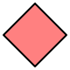 |
| `a-n-A-C-F` | Atom | Neutral / Air / Civilian-Fixed-wing | Neutral civil fixed-wing aircraft | Green square | 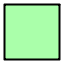 |
| `a-u-S` | Atom | Unknown / Surface (sea) | Unknown surface vessel contact | Yellow quatrefoil | 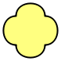 |
| `b-m-p-w` | Bits | Marker / Point / Waypoint | Generic waypoint / rally point marker | Yellow-pin waypoint icon | — |
| `u-d-c-c` | User shape | Drawing / Circle | Geofence (circular boundary + monitor rule) | Filled/outlined circle overlay | — |
| `b-a-o-tbl` | Bits | Alert / Other | Emergency / 911 beacon | Red emergency alert banner | — |
| `b-t-f` | Bits | Text / Freetext | GeoChat message | Chat bubble in the "All Chat Rooms" room | — |

> Note: in MIL-STD-2525/APP-6, **Friend** is the one affiliation whose frame
> *shape* changes per dimension (rectangle on the ground, a rounded dome in
> the air, a circle at sea — see the grid in the next section). **Hostile**
> (diamond), **Neutral** (square), and **Unknown** (quatrefoil) keep the same
> frame shape across every dimension; only the colour and any icon/modifier
> inside the frame change. The images above show the plain affiliation frame
> with no function-specific icon, matching the level of detail in these
> short example CoT types.

> Tip: the CoT `type` alone doesn't carry a callsign, colour override, or
> team name — that lives in the `<detail>` block (`<contact callsign=.../>`,
> `<__group name="Cyan" .../>`, etc.), which both example senders populate.
> See the per-function doc comments in
> [send_cot.cpp](examples/cot-udp/cpp/send_cot.cpp) and
> [send_cot.py](examples/cot-udp/python/send_cot.py) for the exact detail
> XML each symbol carries.

## 8. More examples: Land, Sea, and Air across every affiliation

Section 7 only showed one affiliation per dimension. Here's the fuller
picture — every affiliation (Friend/Hostile/Neutral/Unknown) crossed with
every dimension (Ground/Air/Sea), using the minimal `root-affiliation-
dimension` CoT type (no function id, same pattern as `a-u-S` above). All of
these are valid CoT types you can send/observe; ATAK will draw them with no
icon inside the frame since no function id was given.

| Dimension | Friend (`f`) | Hostile (`h`) | Neutral (`n`) | Unknown (`u`) |
|---|---|---|---|---|
| **Land** (`G`) | `a-f-G`  | `a-h-G`  | `a-n-G`  | `a-u-G`  |
| **Air** (`A`) | `a-f-A` 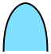 | `a-h-A`  | `a-n-A`  | `a-u-A`  |
| **Sea** (`S`) | `a-f-S` 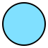 | `a-h-S`  | `a-n-S`  | `a-u-S`  |

Notice the Friend column changes shape per row (rectangle → dome → circle)
while Hostile/Neutral/Unknown reuse the same diamond/square/quatrefoil frame
in every row — that's the same rule called out in the note above, now shown
across all three dimensions side by side.

Adding a function id (like the `G-U-C-I` infantry example in section 7) puts
an icon inside these frames and can add dimension-specific decoration (e.g.
small wings on an air frame, a hull outline at sea) — but the base frame
shape per affiliation/dimension is always one of the six pictured above.

## 9. Icon gallery: installations, surface ships, air, space, and mines

Everything so far used *generic* frames (no function id) or one specific
icon. MIL-STD-2525/APP-6 defines thousands of specific icons drawn inside
those same frames — a few more categories you'll run into on a real map,
identified by their MIL-STD-2525D **entity code** (the numeric id that
selects the icon, independent of which CoT `type` string carries it):

**Land installations** — installations reuse the ground frame with a filled
black bar on top, then an icon for the facility type:

| Entity | Affiliation | Icon |
|---|---|---|
| Airport (121301) | Friend | 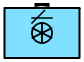 |
| Medical facility (120702) | Neutral | 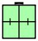 |
| Bridge (110701) | Unknown | 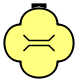 |
| Seaport (121309) | Hostile | 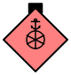 |

**Surface (sea) ships** — the sea-surface (circle) frame with a hull/vessel
icon inside:

| Entity | Affiliation | Icon |
|---|---|---|
| Destroyer (120203) | Friend |  |
| Frigate (120204) | Hostile | 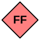 |
| Amphibious ship (120300) | Neutral |  |
| Merchant vessel (140200) | Unknown | 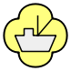 |

**Air** — more airframes beyond the generic dome:

| Entity | Affiliation | Icon |
|---|---|---|
| Bomber (110103) | Friend | 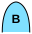 |
| Fighter (110104) | Hostile | 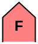 |
| UAV (110300) | Neutral |  |
| Military rotary/helicopter (110200) | Unknown |  |

**Space** — the air frame shape plus a filled cap on top; the plain/generic
space object at each affiliation:

| Affiliation | Icon |
|---|---|
| Friend | 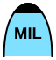 |
| Hostile |  |
| Unknown | 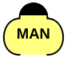 |

**Sea mines** — drawn in the MEDAL style: an unfilled frame stroked in the
pure affiliation colour, with a spiked-circle mine icon inside:

| Entity | Affiliation | Icon |
|---|---|---|
| Mine, generic (WM) | Neutral | 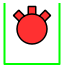 |
| Mine, moored (WMM) | Unknown |  |
| Mine, ground/bottom (WMG) | Hostile |  |

> These entity codes are MIL-STD-2525D icon selectors, not CoT `type`
> strings — CoT represents installations, space objects, and mines through
> its own function-id vocabulary (e.g. an `I` token for installations under
> the `G` dimension), which is deeper than this primer covers. Check ATAK's
> bundled CoT types reference for the exact string for a given icon; the
> icons above tell you what MIL-STD-2525/APP-6 will draw once ATAK resolves
> the type.

## 10. Try it yourself

```bash
# C++
cmake -B examples/cot-udp/cpp/build -S examples/cot-udp/cpp
cmake --build examples/cot-udp/cpp/build
./examples/cot-udp/cpp/build/send_cot --verbose

# Python
python3 examples/cot-udp/python/send_cot.py --verbose
```

Both scripts walk through all eight symbols above, one per second, over UDP
multicast — open ATAK/WinTAK on a device on the same network/subnet and
watch them appear.

## 11. Further reading

- **[MIL-STD-2525](https://en.wikipedia.org/wiki/MIL-STD-2525)** (US DoD) —
  the formal standard defining frames, icons, and modifiers referenced
  throughout this doc. The current version is 2525D/2525E; official copies
  are distributed via the DoD ASSIST document database.
- **[APP-6](https://en.wikipedia.org/wiki/APP-6)** (NATO) — the allied
  equivalent of MIL-STD-2525, published as a NATO standardization agreement
  (STANAG 2019).
- **[Cursor-on-Target (CoT)](https://en.wikipedia.org/wiki/Cursor_on_Target)**
  — the underlying XML schema; the `type` scheme described here is the
  informal convention ATAK/TAK Server follow, not a separately-published
  spec.
- **[ATAK-CIV](https://github.com/deptofdefense/AndroidTacticalAssaultKit-CIV)**
  — the official open-source ATAK client. Its source tree ships the
  authoritative `CoT Types.xml` used to resolve `type` strings to symbols
  and behaviour — the definitive reference for anything this primer only
  approximates (installations, space, mines, and deeper function-id trees).
- **[TAK.gov](https://tak.gov)** — the official TAK ecosystem site (ATAK,
  WinTAK, iTAK, TAK Server), with developer documentation and downloads.
